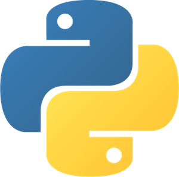

# **Mücahit Bilal GÖKER**

## Work Experience 🎩

---

### Computational Design Specialist [@Kalyon Co.](https://kalyonholding.com/Home)

*Jan 2020 - Present*

- Responsible for developing solutions regarding automation processes
- Improving the quality of submissions
- Automated nearly all the major man-hour tasks with Dynamo/Grasshopper (examples can be seen in Scripts tab.)
- Created a "Knowledge Hub" that includes technical documentation and video tutorial on how to use scripts that are created for the project.
- Responsible for BIM Modeling processes, clash detection and 4D simulations of the projects
- Organizing workshops and teaching colleagues Revit and Dynamo/Grasshopper as an instructor.
- Active support to coworkers' development, motivation, and retention processes

### BIM Architect [@VIVA Architects](http://www.vivaarchitects.com)

*June 2019 - Jan 2020*

- Responsible for BIM Modeling processes
- Content and Template creation for the office
- Creating folder structure for the office so it complies with local/international standards.
- Participated in modeling/coordination/documentation processes.

### Intern [@RSY Construction](http://rsyinsaat.com)

*July 2018 - Oct 2018*

- Implementation of a mixed use project in Uskudar and a tower project in Ankara.
- Modeling of structural project
- BIM Modeling - floors, ceilings, walls etc.
- Providing appropriate activation codes for objects
- Assisting and teaching other interns Revit.

### Freelance Instructor 👨‍🏫

*July 2017 - Present*

- Giving courses to individuals and companies about AEC tools such as *Rhino, Grasshopper, Revit and Dynamo.*

## Education 🏫

---

### Istanbul Technical University

*Sept 2014-Jan 2019*

Bachelors in Architecture

- Diploma thesis: “Movie Production Complex in Istanbul, Turkey”

### MSGSU

*Sept 2020-June 2022 (expected)*

Masters in Architectural and Urban Informatics

## Skills 🐱‍👤

---
<table style="width:100%; text-align: center; margin-left: auto; margin-right: auto;" >
    <tr>
        <td style="padding: 0 50px"></td>
        <td style="padding: 0 50px"></td>
        <td style="padding: 0 50px"></td>
        <td style="padding: 0 50px"></td>
    </tr>
    <tr>
        <td>Autodesk Revit</td>
        <td>Dynamo</td>
        <td>Rhinoceros</td>
        <td>Grasshopper</td>
    </tr>
    <tr>
        <td>⭐⭐⭐⭐⭐</td>
        <td>⭐⭐⭐⭐</td>
        <td>⭐⭐⭐⭐</td>
        <td>⭐⭐⭐⭐</td>
    </tr>
    <tr>
        <td style="padding: 0 50px"></td>
        <td style="padding: 0 50px"></td>
        <td style="padding: 0 50px"></td>
        <td style="padding: 0 50px"></td>
    </tr>
    <tr>
        <td>Sketchup</td>
        <td>Navisworks</td>
        <td>AutoCAD</td>
        <td>Python</td>
    </tr>
    <tr>
        <td>⭐⭐⭐⭐⭐</td>
        <td>⭐⭐⭐⭐</td>
        <td>⭐⭐⭐⭐</td>
        <td>⭐⭐⭐</td>
    </tr>
</table>

Above are list of softwares that I am most confident about. Other than that:

- I know **Adobe Photoshop** and **Illustrator**. My **Photoshop** skills are better than **Illustrator** ones though.
- I have tried to pass my processes to open source.
- I have tried **Blender** but decided it is not suitable (yet) for architectural design (at least for me😅).
- I also tried **Unreal Engine 4** for visualization purposes but it was sucking the energy⚡ out of my laptop💻, so i sticked with the solutions I currently use which are **Enscape** and **Twinmotion**.

## Achievements 🥇

---

### Honorable Mention [@eVolo Skyscraper Competition 2019](https://www.evolo.us/arbor-tower/)

April 2019

Arbor Tower project have been awarded with Honorable Mention at eVolo Skyscraper Competition 2019. You can see the project details on the link above.☝🏻

### 3rd Place @Design Together with BIM

April 2018

Project includes the design of a social center to be used by students at Ayazaga Campus. Main point of this competition was designing a building with other disciplines involved in a BIM process.

## Community and Volunteer Experience 🤝

---

Much of what I have learned is from the people around me 👨‍👨‍👦. For this reason, if I want to improve💪🏻 myself in a field, I surround myself with people who are interested🤔 in that subject. It's also really nice to be with people you speak🗣️ the same language with.

[BIM4TURKEY](https://bim4turkey.com/en) is a platform belonging to “Building Information Modeling and Management Association”. It aims to facilitate the integration of Building Information Modelling and Management (BIM) easier and smoother to the building industry, higher education and public companies.

We have founded it to create an atmosphere around the subject of BIM. Now, it has turned into an umbrella organization☂ rather than a platform. All the major construction companies (such as TURNER, Kalyon (my current company), BSI and many more) have partnered with us in achieving our mission💪🏻.

`CO.DE:IST` is a community of Computational Design enthusiasts in Istanbul. Our reason for establishing this community was to learn from each other and increase the knowledge in our country.

We get together every two weeks and each week has its topic. That week's speaker presents his work to the community. Presentation topics can be a solution brought by the speakers in their workflow processes via **Dynamo**, **Grasshopper** or **Revit API**. We have learned a lot from each other since this community was formed.

The **Open-Source Architecture Community** brings together like-minded users and developers who share a common goal: that the built environment can be designed, constructed, operated, and recycled with free/libre and open-source software, with increased transparency, and a more ethical approach.

I have been involved with the OSArch community for about **a year** now. I have been creating **graphic designs🖼** for meetups and operating the **[OSArch Youtube Channel🔴.](https://www.youtube.com/c/OSArchOrg/videos)**
    