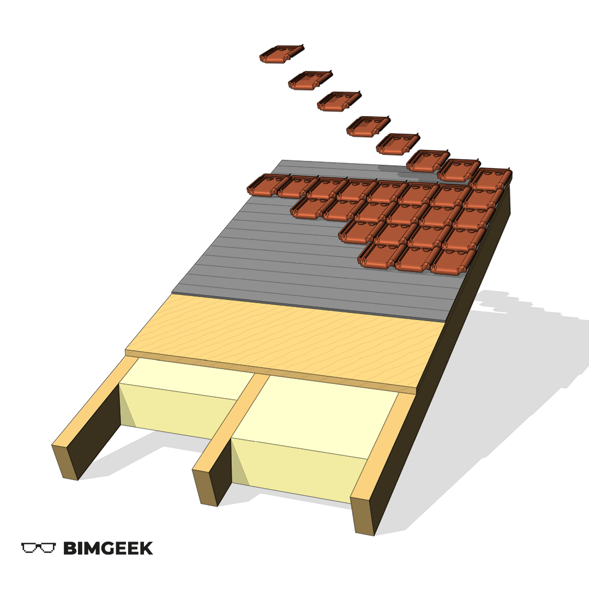



---

Herkese selamlar,

Proje detayları 3 boyutlu olarak ifade etmek, grafik anlamda ve karşıdaki kişinin anlamasını kolaylaştırması açısından güzel oluyor. Bu videoda basit bir çatının 3 boyutlu bir diyagramını yaptık. İyi seyirler.

<a href="files/3DCatiDiyagrami.rvt" download>
    
</a>

