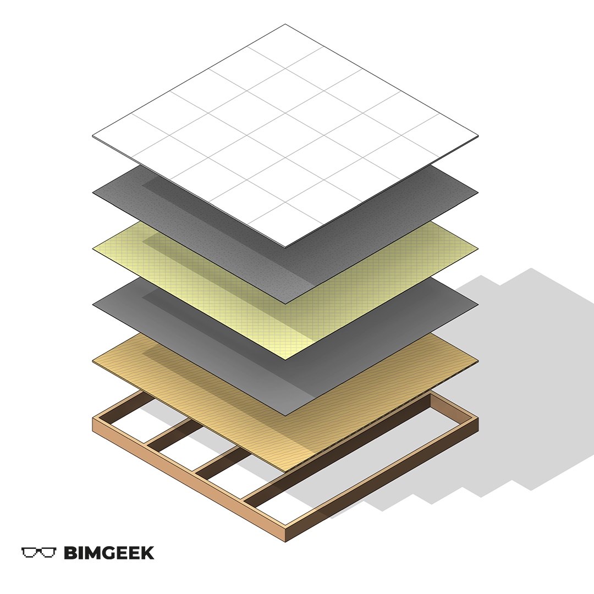



---

Herkese selamlar,

Bu videoda, Patlamış Axonometrik görünüşte bir döşemeyi katmanlarına ayırarak bir grafik elde ettik. Daha önceki videolarda işlediğimiz Create Parts ve Displace Elements komutlarının birlikte çalışılabilirliği üzerinden nasıl sonuçlar elde edilebileceğini de göstermiş olduk. Her şey adım adım videoda!

<a href="files/3DDosemeDiyagrami.rvt" download>
    
</a>

