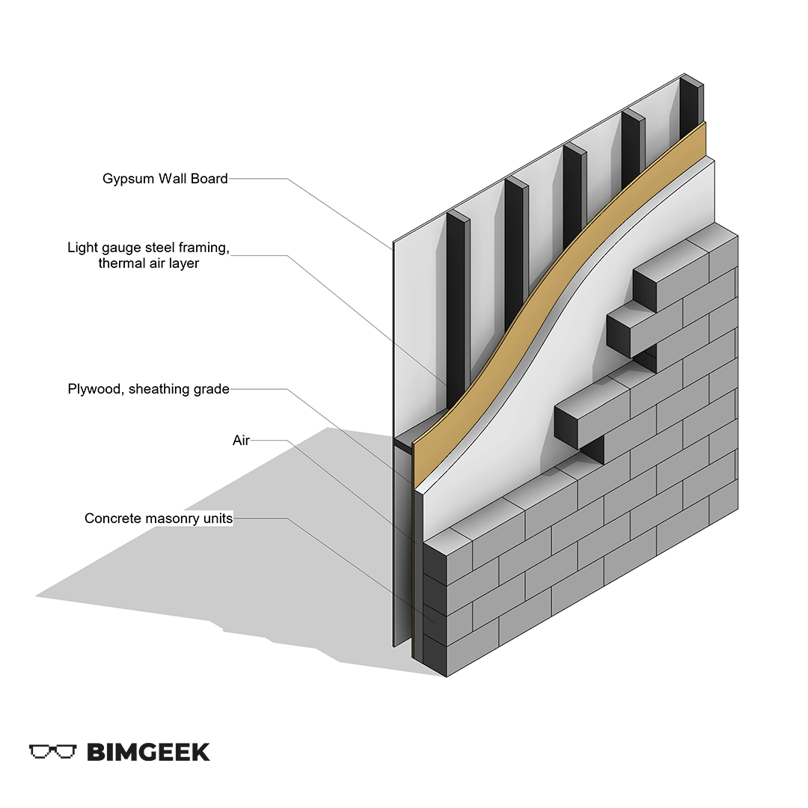



---

Herkese selamlar,

Bu videoda Revit'te '3D Duvar Diyagramı' oluşturacağım. Aslında Create Parts komutunu tanımak adına güzel bir video olacak. Bu komut sayesinde 3D duvar, döşeme ve çatı detayları çıkarmak ve hoş grafiklerle ifade etmek mümkün. İyi seyirler.

<a href="files/DuvarDiyagram.rvt" download>
    
</a>

