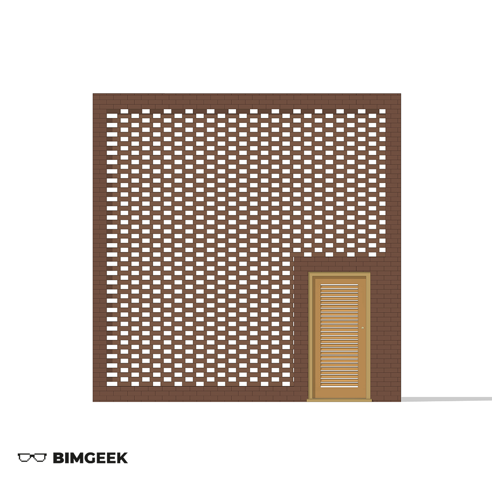
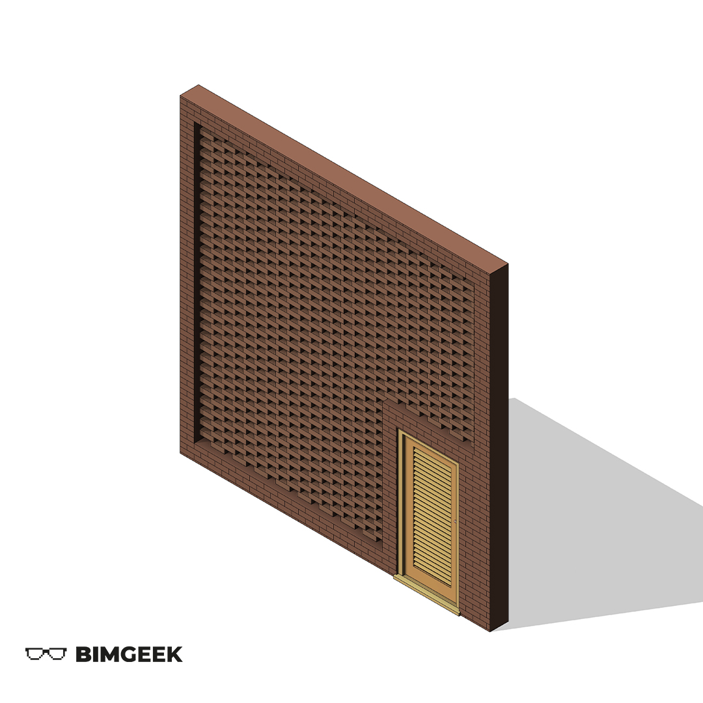



---

Herkese selamlar,

Bu videoda İngilizce'de "Perforated Brick Wall" veya "Brick Breeze Wall" da denilen Boşluklu Çarpraz Tuğla Duvar modellemesi gerçekleştirdim. Generic Model ve Curtain Wall Panel Family ortamlarının çalışma şekillerini anlamak adına güzel bir video oldu. İyi seyirler.

<a href="files/Museo Soumaya - Mass.rfa" download>
    
</a>

