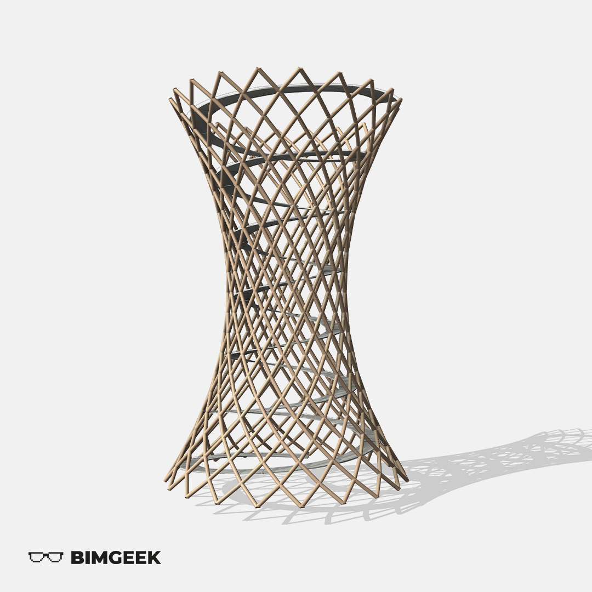



---
Bu videoda EFFEKT Mimarlık ofisinin tasarladığı Danimarka'da yer alan Camp Adventure Gözetleme Kulesi projesini Revit'te modelledim. Adaptive Component ve Mass environment'a dair incelikler içeren bir video oldu. İyi seyirler.

[Camp Adventure Observation Tower / EFFEKT](https://www.archdaily.com/914486/camp-adventure-observation-tower-effekt?ad_source=search&ad_medium=search_result_all)

<a href="files/Project_Camp Adventure.rvt" download>
    
</a>

