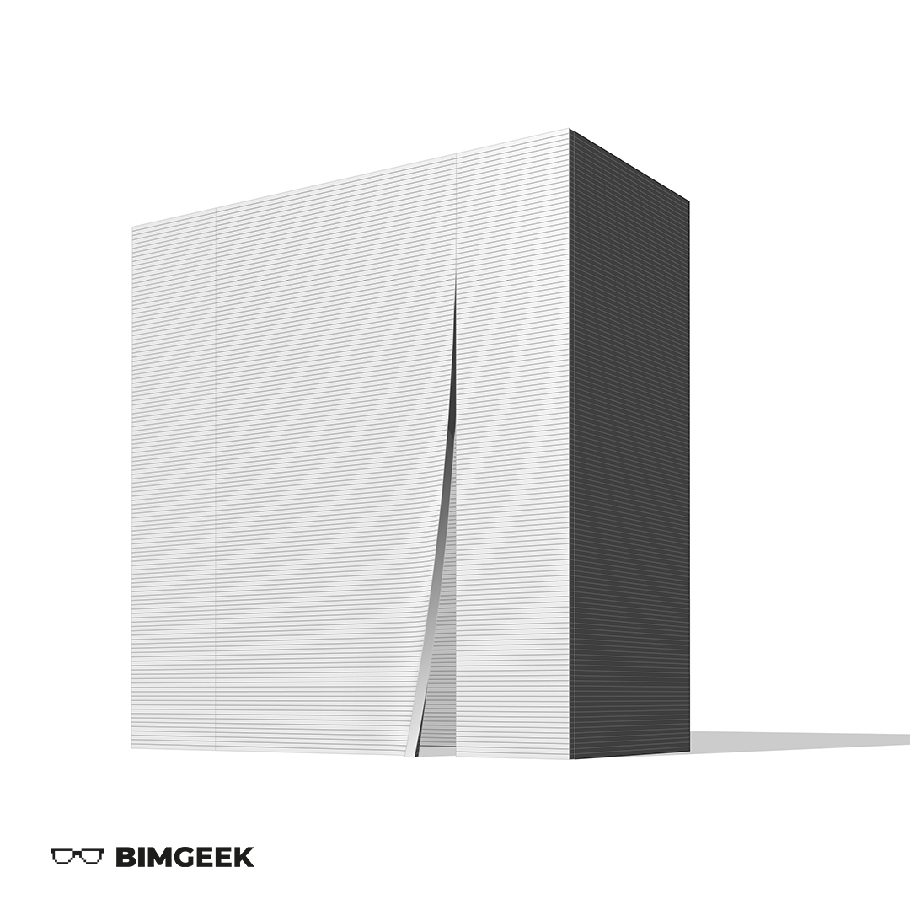



---

Herkese selamlar,

Bu videoda Philip Johnson'ın Houston'da yer alan 'Chapel of St. Basil' projesini modelledim. Fermuar gibi açılan duvar, Mass modelleme ortamıyla aşina olmak adına güzel bir örnek oldu. 
İyi seyirler.

<a href="files/Chapel of St.Basil.rvt" download>
    
</a>

