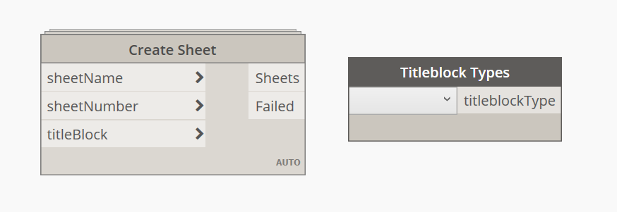
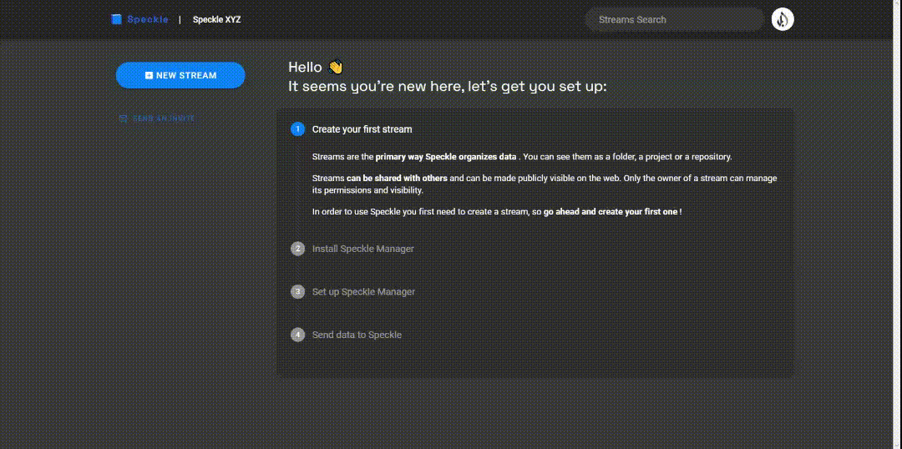
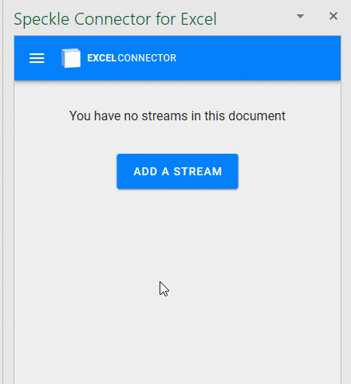
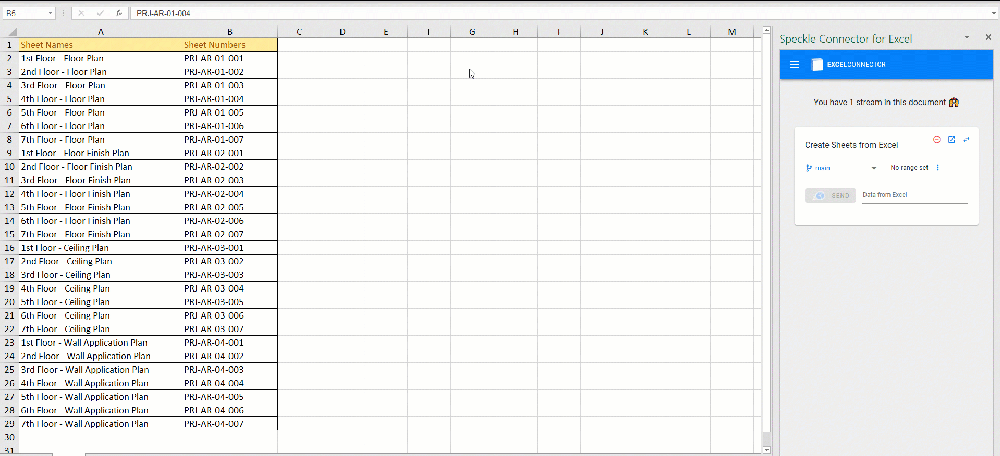
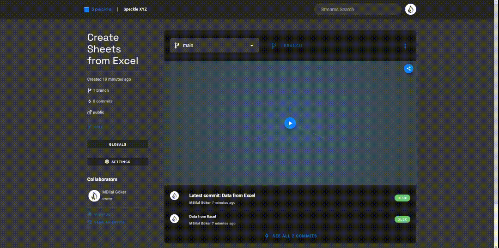
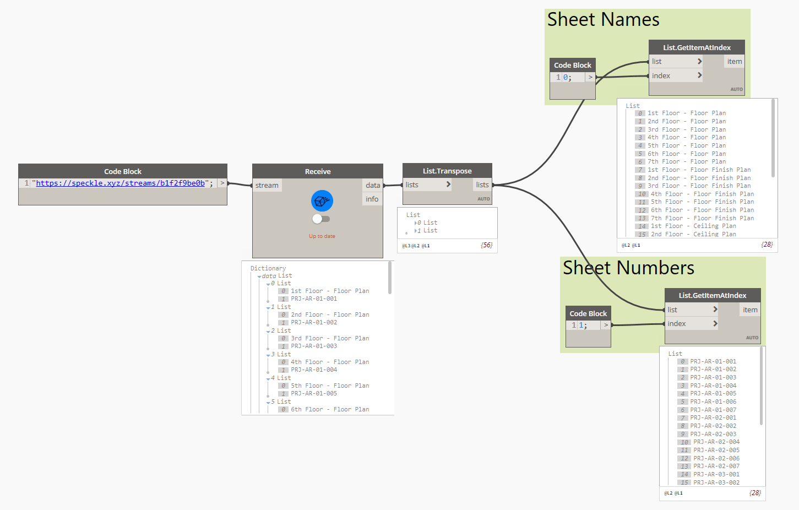
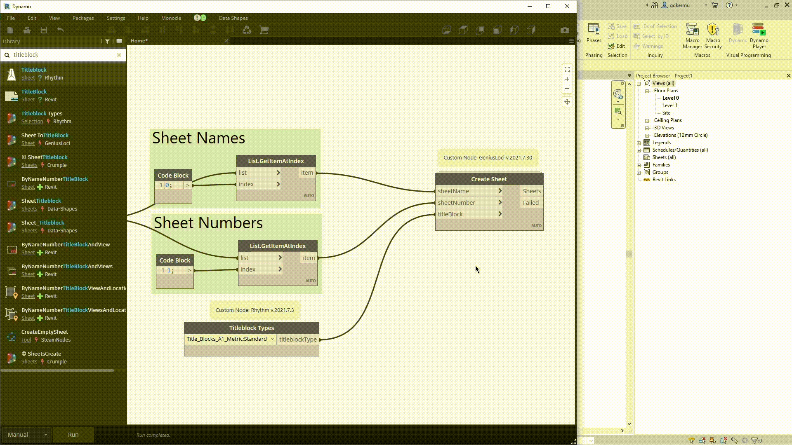

In this tutorial, we'll create Revit Sheets from Excel table containing Sheet Names and Numbers with Dynamo. Especially in large scale projects, creating hundreds of sheets manually just doesn't make any sense. Since we are already populating sheet names, numbers and any other data in Excel, why not use that data in Dynamo directly and automate this task. Let's just do that👇!

### **Prefer watching than reading? Here's a video too!**



### Prerequisites

To follow this tutorial you'll need the following:

- Excel
- Dynamo (I'm using 2.10 inside Revit 2022)
- a Speckle account (you can get one at **[https://speckle.xyz/](https://speckle.xyz/)**)
- the Speckle Connector for Dynamo (install it via **[Manager](https://speckle.guide/user/manager.html)**)
- the Speckle Connector for Excel (install via Office store, **[instructions](https://speckle.guide/user/excel.html)**)

### Tutorial Files

You can access the Excel table used in this tutorial from down below👇:

<a href="Sheet_Names_and_Numbers.xlsx" download>
    
</a>

### Custom Nodes

We are using custom components in this definition. You need to install **Genius Loci** and **Rhythm** packages. To learn more about installing custom packages in Dynamo 👉 **[Dynamo Primer](https://primer.dynamobim.org/11_Packages/11-1_Introduction.html)**

## Creating a Stream

We'll start by creating a stream and it is really easy. 

- First, go to your Speckle server (I am using [speckle.xyz](http://speckle.xyz))
- Click on the friendly blue button in the top left corner.
- Then type the name of your stream (we named our stream as **Create Sheets from Excel.**),
- Give it a description (optional)
- Click the create button.

That's it - a new stream has just been born!

## Sending Data from Excel

In Excel, we just need to add the stream to our document. Just click on **Add a Stream** button or on the top left menu > Add stream > click on a stream to add to the document.

By default, streams are added as receivers but you can easily switch them to sender mode.

To send data from Excel, just select the range of data you want to send, click "Set range" and click on **Send**.

You can view your Excel data in Speckle server. This is how it will look like👇:

## Receiving Data in Dynamo

Receiving data in Dynamo is very simple: You just need a **`Receive`** node, and a `Stream URL` as a string. When new data is pushed to this stream a notification will appear on the receive node.

<video width=100% controls autoplay>
    <source src="images/receiving_data_in_dynamo.mp4" type="video/webm">
    Your browser does not support the video tag.  
</video>



## Creating Revit Elements

We received our Excel data in Dynamo. Congrats 🎉🎉! The next step will be manipulating this data and use it to create Revit elements. Lets do that🏃‍♂️🏃‍♀️!

First, we are going to `Transpose` this list. After that, we will use `Get Item At Index` node to get each list separately. Our first index will be `0` and second index will be `1`. By doing so we separated our Sheet Names and Sheet Numbers from each other. 

Now is the exciting part. Lets create some Sheets 🚀! For this we are going to use `Create Sheet` node from **Genius Loci**. This node expects 3 inputs. Sheet names, Sheet numbers and Titleblock Type. We have our Sheet names and numbers as separate lists. We are going to use `Titleblock Types` node from **Rhythm** for the third input. Select the titleblock type and connect it to the last input.

When we click on `Run` button, Voila🎊, list of sheets with appropriate names and numbers are created. Good job💪!

---

## **Conclusion**

We hope you enjoyed this tutorial and found it useful!

**Speckle is an Open Source project** and we really ❤️ feedback, so if you have any questions, comments, critiques, or praises please let us know on our **[community forum](https://speckle.community/)**.