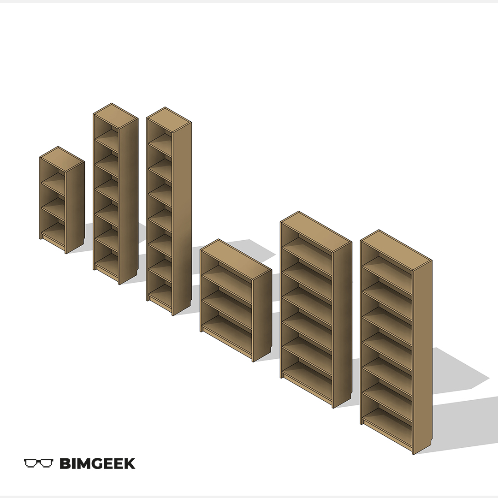



---

Bu videoda IKEA'nın Billy kitaplık serisini Revit'te modelledik. Billy serisi, farklı malzeme seçenekleri ve farklı boyutlarda alternatifler sunması bakımından güzel bir seçim oldu. Videoda, formüller, nested families ve parametrelerin birbirleriyle olan ilişkilerine değindik. İyi seyirler.

<a href="files/Ikea_Kitaplık.rfa" download>
    
</a>

