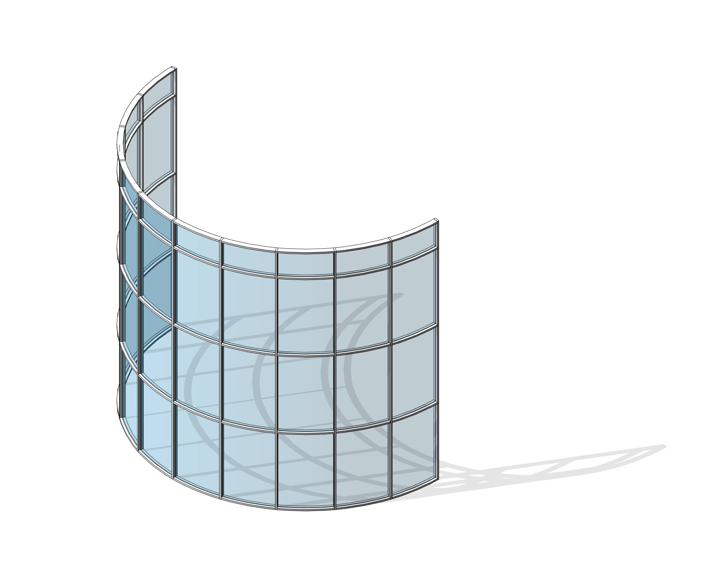



---

Herkese selamlar,

Revit'te tam anlamıyla kıvrımlı bir giydirme cephe yapmak mümkün değil. Bu videoda, dolaylı yoldan bir kıvrımlı cephe modelledim. İyi seyirler.

<a href="files/KıvrımlıGiydirmeCephe.rvt" download>
    
</a>

