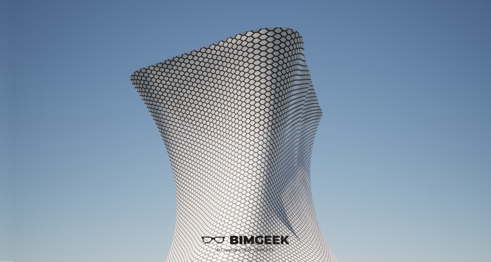



---

Herkese selamlar,
Bu videoda FR-EE tarafından tasarlanan Soumaya Museum projesini Revit'te modelledim. Amorf formuyla ve cephesini kaplayan panelleriyle dikkatleri üzerine çeken proje Meksika'nın başkenti Mexico City'de yer alıyor. Mass modelleme ve Pattern Based Curtain Wall Panel family i tanımak anlamında güzel bir içerik oldu.
İyi seyirler.

[Soumaya Museum / FR-EE Fernando Romero Enterprise](https://www.archdaily.com/452226/museo-soumaya-fr-ee-fernando-romero-enterprise?ad_source=search&ad_medium=search_result_all)

<a href="files/Museo Soumaya - Cephe Paneli.rfa" download>
    
</a>

<a href="files/Museo Soumaya - Mass.rfa" download>
    
</a>

