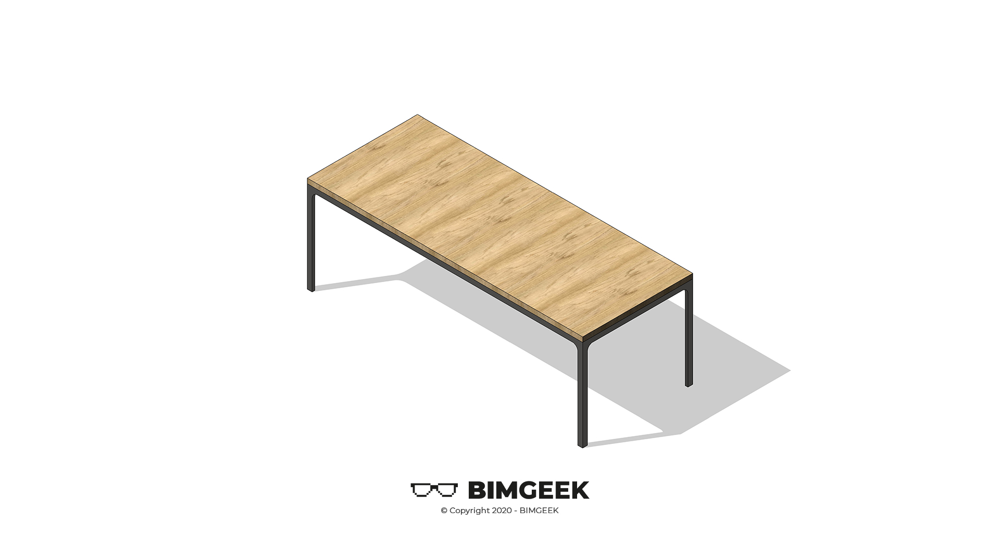



---

Herkese selamlar,

Bu videoda Revit'te Kelebek Çatı modellemesi gerçekleştirdim. Aynı formu farklı yöntemler kullanarak oluşturmak çatı modelleme araçlarını keşfetmek adına güzel oldu. İyi seyirler.

<a href="files/ParametrikMasa.rfa" download>
    
</a>

