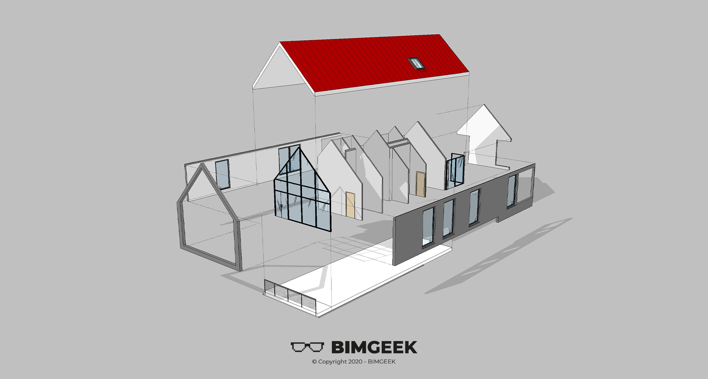



---

Herkese selamlar,
Bu videoda sadece Revit kullanarak bir Patlamış Perspektif görseli oluşturdum. Displace Element komutunu ve Revit'in grafik anlamda potansiyelini ortaya koymak adına güzel bir video oldu. İyi seyirler.

<a href="files/PatlamisAksonometrik.rvt" download>
    
</a>

