In this tutorial, we'll send some Revit elements to Rhino and the geometry in Rhino will contain selected Revit parameters. This workflow contains a lot of use cases but I will create a really simple script that will color Revit elements by their properties, just to demonstrate the structure of the data that comes from Speckle and how we can use it in the workflow.

Let's get started!🏃‍♂️

### **Prefer watching than reading? Here's a video too!**


## Tutorial Files

You can access the Grasshopper definitions used in this tutorial down below 👇:

<a href="tutorial-files-revit-elements-to-rhino-using-speckle.rar" download>
    
</a>

## Prerequisites

### General Requirements

To follow this tutorial you'll need the following:

- Revit 2018 - 2022 (I'll be using 2022)
- Rhino 6/7 (I'll use Rhino 7)
- a Speckle account (you can get one **for free🎉** at **[https://speckle.xyz/](https://speckle.xyz/)**)
- the Speckle Connector for Grasshopper (install it via **[Manager](https://speckle.guide/user/manager.html)**)
- the Speckle Connector for Revit (install it via **[Manager](https://speckle.guide/user/manager.html)**)

Since we are using Revit and Grasshopper to achieve the workflow, you need to have the  basic knowledge of how to use both solutions😇

### Grasshopper Plugins

When it comes to Grasshopper plugins, **WombatGH** and **Elefront** needed. Details to that👇:

[Elefront](https://www.food4rhino.com/en/app/elefront)

[WombatGH](https://www.food4rhino.com/en/app/wombatgh)

## Creating a Stream and sending data from Revit

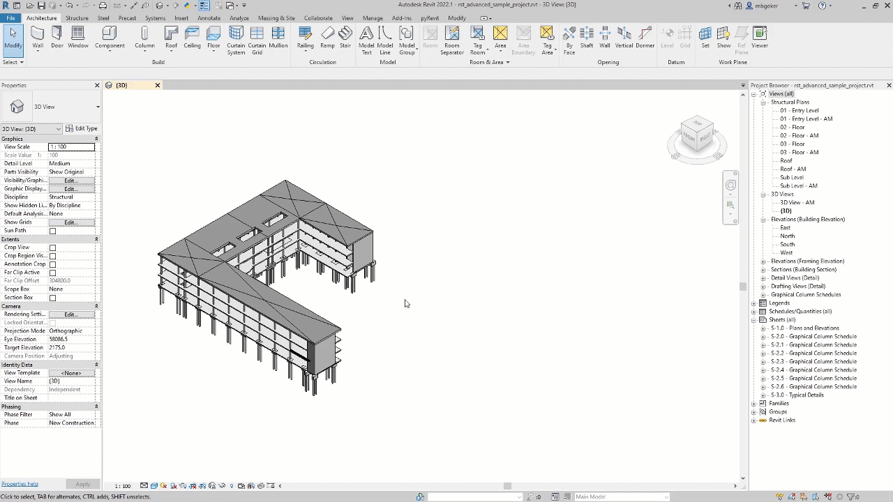

Let's open the document and create a new stream. It just takes three steps:

1. Go to **Add-Ins** and open **Revit connector**.
2. Click the blue button on the **bottom right corner**.
3. Use text box to **name** your stream and click the "**+**" button to create a new stream.

There are couple ways to send data from Revit. But we are going to do it the manual way.

1. Choose what you want to send by **selecting** it.
2. Click on the **blue button** in the middle of the card.
3. Select the "**Set selection**" option
4. And finally **double click** on **Send** to send data straight away.

## Receiving in Grasshopper

Receiving data is also super easy: you just need the link! Copy the URL and paste it in a **Panel**. Then just plug it into a "**Receive**" component and click the "**Receive**" button. Voila, the stream is received!

## Defining Object Attributes

Lets start by examining the received data. When we connect a panel to the data output, we can see that the output is a **Base object.** The base object class (actually called `Base`) is the foundation of all data being transferred with Speckle.

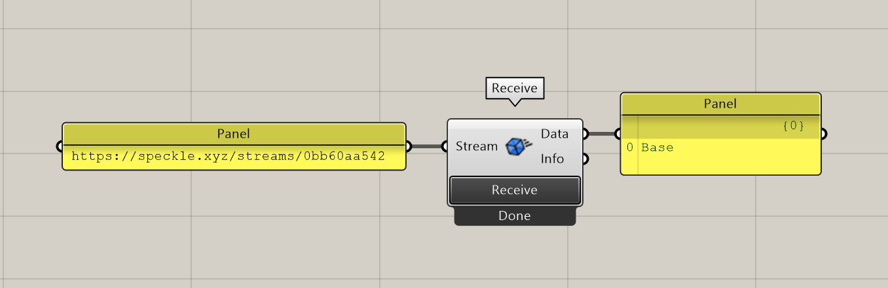

### Expand Speckle Object

Let's connect a **Expand Speckle Object** node to display the contents of that Base object. Using the object converter, expand node outputs the contents of the Base object. Selected elements will be listed by their Speckle types.

In this example, we can see that our elements are grouped under 8 lists. We'll transfer **Floors**, **Structural Columns**, **Structural Foundations**, **Structural Framing** and **Walls**.

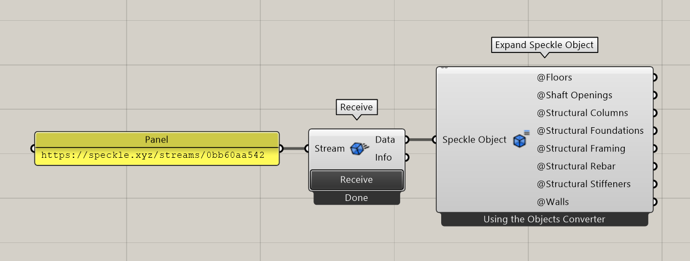

First, we'll use **Merge** node to merge these lists and then **Expand** it again to see the attributes of received objects.

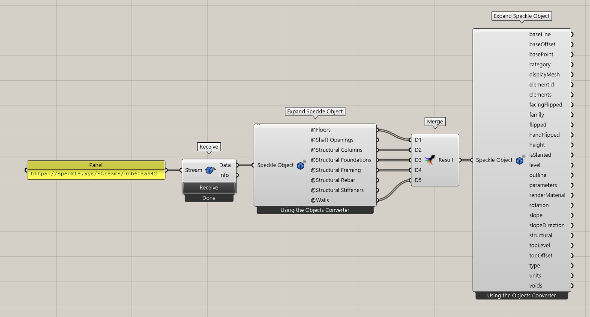

This time **Expand Speckle Object** node will output the attributes of the selected objects. In this tutorial we will use following attributes:

- **displayMesh**: displayMesh contains the geometry of the element. It will be received as mesh geometry in Rhino.
- **elementId**: Revit Element Id of the selected element. We are going to use the value of it as the name of the geometry.
- **type**: Type name of the Revit element. An example is "Generic Concrete 300mm". We will create a **type** attribute and set this as the value.
- **speckle_type**: Returns Speckle Type of the element.
- **level**: Level of the selected element. The value of this element will also be a Speckle Object and we only need the name of the level. So we will connect another expand Speckle object to get the parameter name.

### Speckle Object Value by Key

After we have the names of the attributes we are looking for, instead of connecting an **Expand** node, we can connect **Speckle Object Value by Key** node. This node expects an **Object** and a **Key**, and it returns the value of the given key.

We will connect the **Merge** result to the **Object** input of this node and connect the above parameters as the **Key** input.

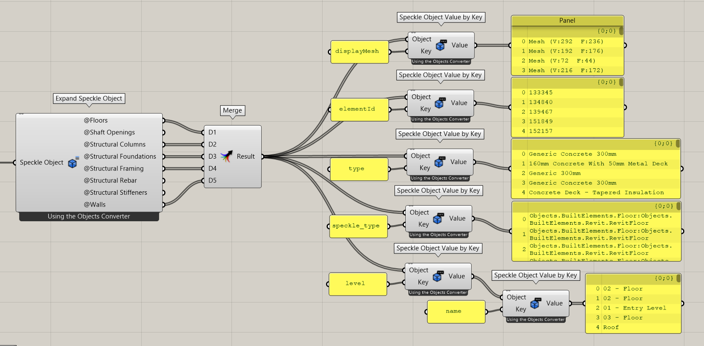

Now we have the keys and the values of the attributes, let's create them. For that, we will use **Define Object Attributes** from **Elefront**.

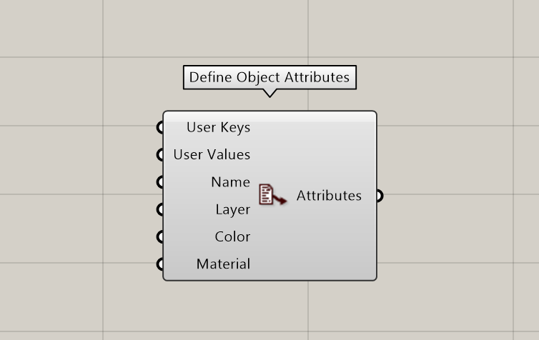

- **User Keys**: This will be the merged list of the keys. In our case, **type** and **level**.
- **User Values**: Again, Merged list of the values of those keys. But be careful, you should graft the inputs to have two items in each list, one for the type and one for the level. Otherwise, you will end up with two lists.
- **Name**: The values of the elementId key. This will also be grafted.
- **Layer**: Layer will be the category of the elements. Also grafted. But first we have to define the layers. For that, we will use **Define Layer** node from Elefront to create Layers from unique names.

Do not forget to **flatten** the output depending on the structure of your lists.

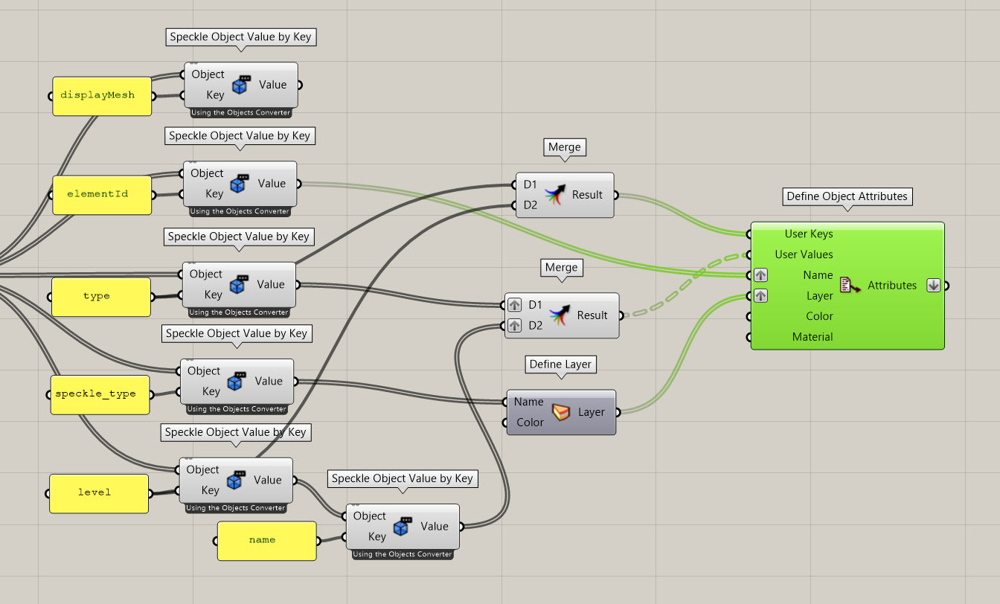

Now we created the attributes, let's add them to the geometry. We will use `Bake Objects` from `Elefront` to bake mesh geometry with their corresponding attributes. Let's give it a BakeName: "*Revit to Rhino with Properties*". **Bake** input expects a **Boolean** so I will connect a **Button** to that. When I hit it, Boolean will turn True and it bakes the geometry.

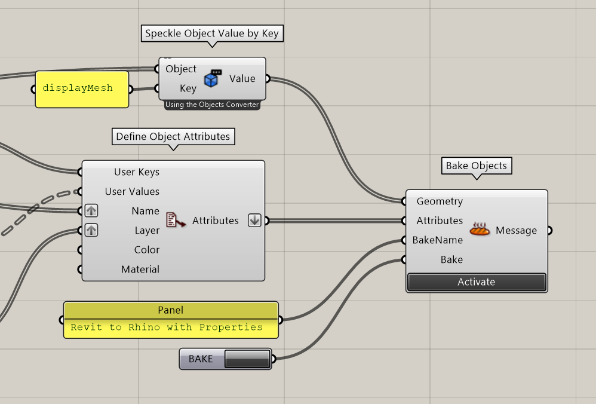

This will be the final result.

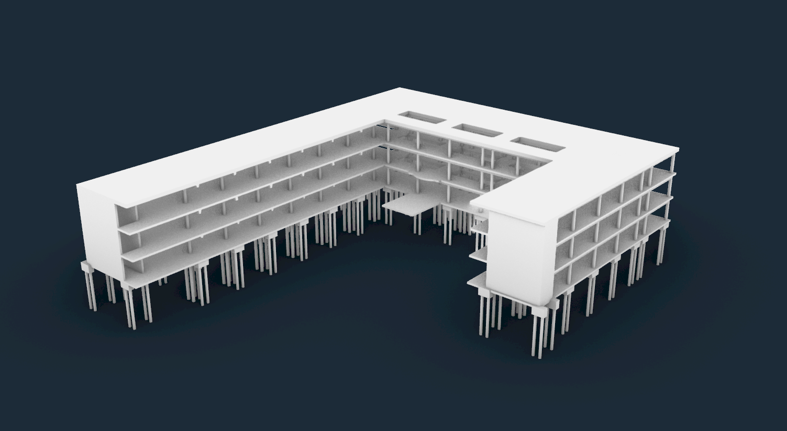

Other than geometry, we also have the information embedded in the model 🎉🎉

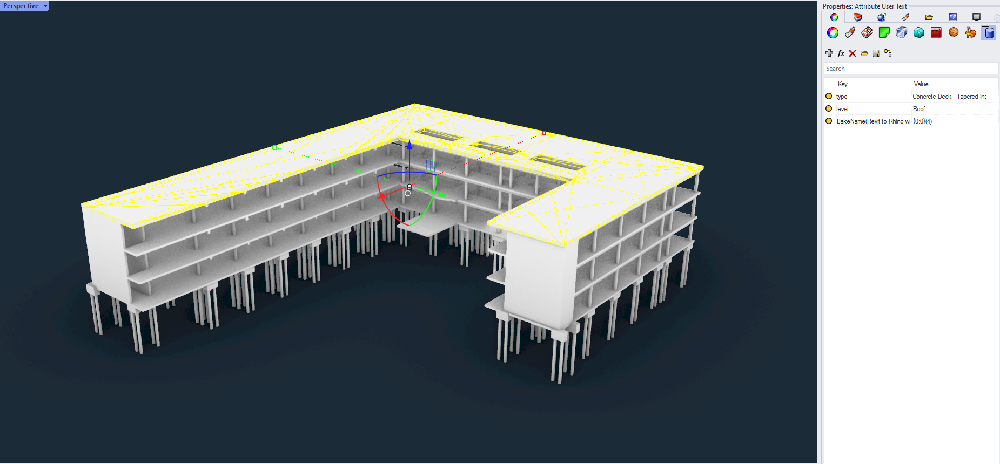

## Coloring by Attributes

In the previous part, we embedded the properties. There are potential use cases for it and we will demonstrate the first thing that comes to mind: Coloring them by their attributes in Rhino. 

Let's do it💪!

### Referencing Geometry

Lets start with referencing the geometry we baked. Since they are Mesh, we can use **Reference by Type** node and connect **Mesh** as the input.

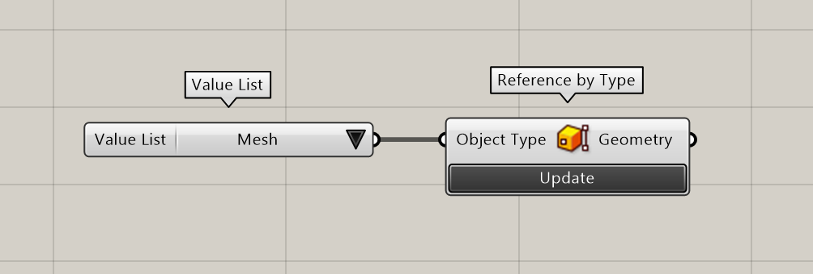

### Get Attribute Values

Now we have the geometry, let's get the attribute values. We will use **Get User Value** and connect "**type**" string for the **Key** input. This will output Revit Type names as the output.

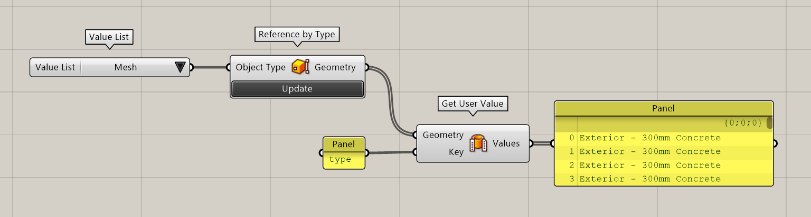

### Create Color For Each Type

Lets create a color for each unique types. We will convert our **List** to a **Set** to get unique items. Then we'll use **Random Color** from **WombatGH** to create a color for each item connected.

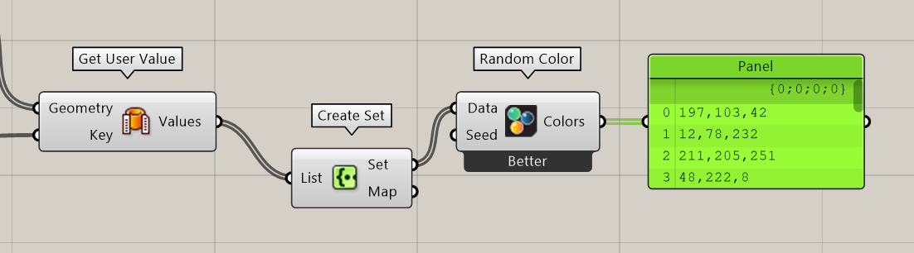

### Create Color For Each Element

Lets match these colors with corresponding elements. We'll use **List Item** to match the order of two lists and connect **Map** output of Set as the **Index** input of List Item.

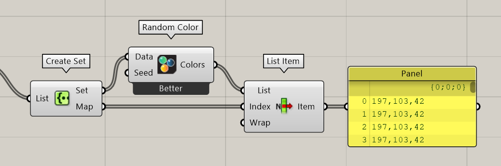

### Add Color to Geometry

You've made it so far, congrats👏! Lets add colors to the geometry. First lets convert these colors to **Elefront Attributes**, then we have to modify the color attribute of the Rhino geometry and we will use **Modify Rhino Attributes** for that. Connect mesh geometry to the geometry input, Elefront attributes to the attributes input and a Boolean value of True to the modify input.

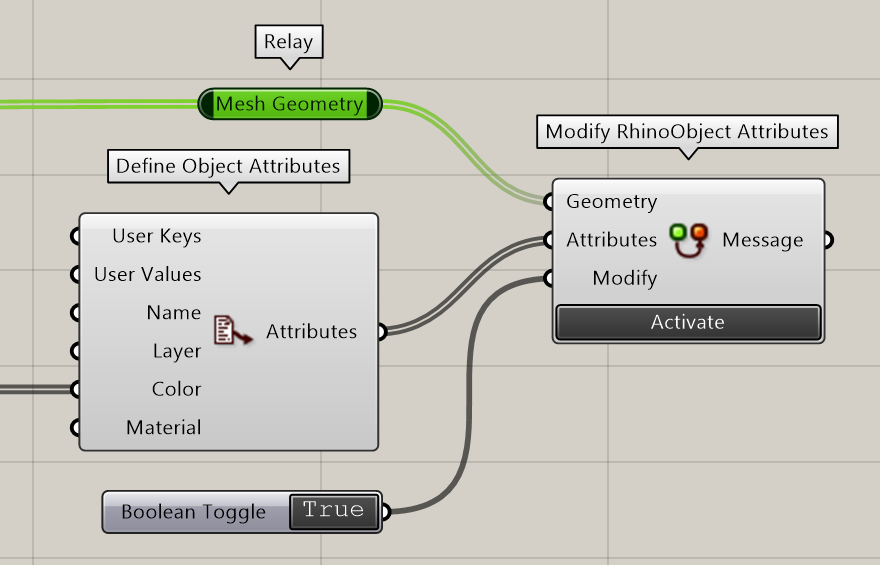

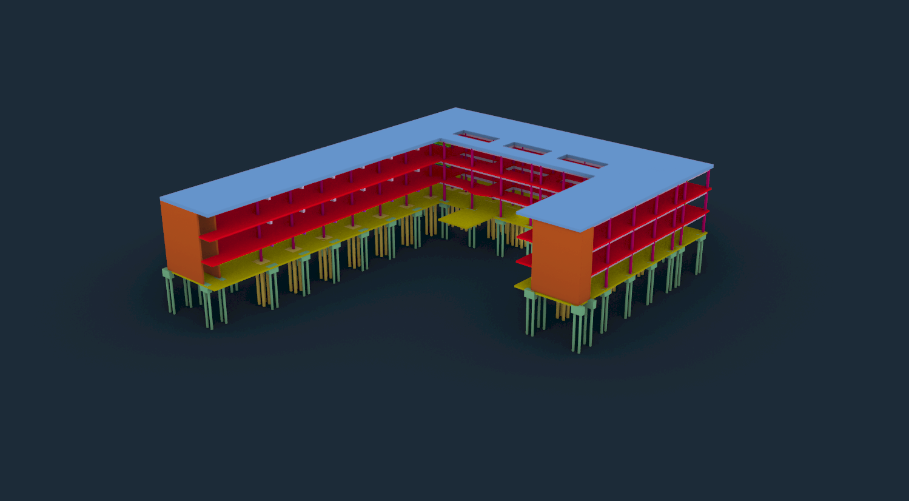

*Colored by Type Attribute*

Ta Da!🎊🎊🎊 You've made it. They are colored by their type attributes now! You can color it by any of its attributes. Try it yourselves. Below is colored by Level attribute instead of type.

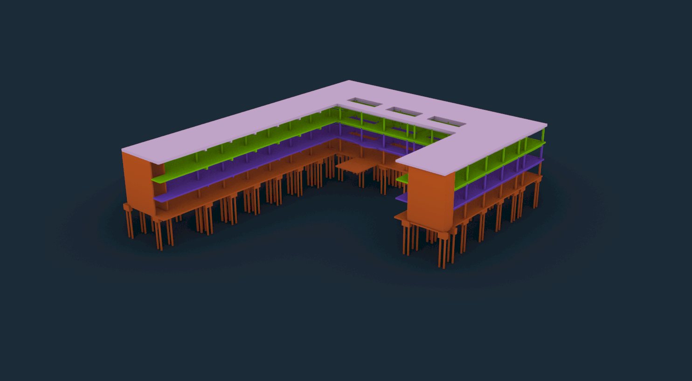
*Colored by Level Attribute*

---

## **Conclusion**

We hope you enjoyed this tutorial and found it useful!

**Speckle is an Open Source project** and we really ❤️ feedback, so if you have any questions, comments, critiques, or praises please let us know on our **[community forum](https://speckle.community/)**.