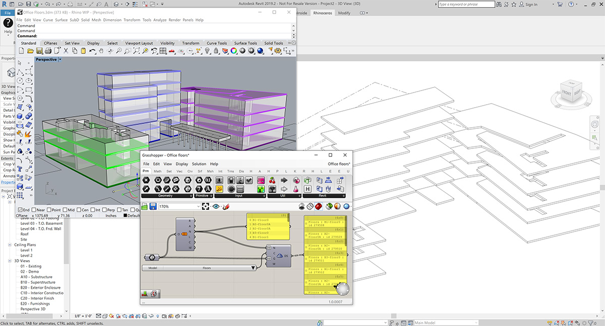
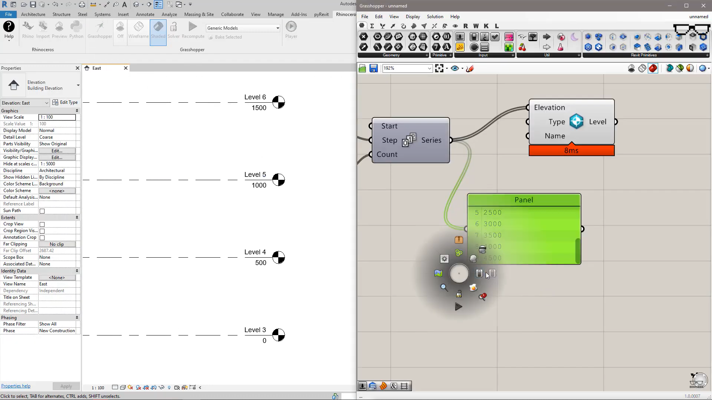

*Grasshopper ile yapılmış mimari projelere bir örnek: Shanghai Tower, Gensler*

### Rhino ve Grasshopper

Rhino🦏, McNeel tarafından geliştirilen bir 3D modelleme uygulaması ve 1980'de piyasaya sürülmesinden bu yana, **güçlü geometri motoru💪** ve **çok yönlülüğü** nedeniyle mimari, imalat, endüstriyel tasarım ve ürün tasarımı için kullanılan önemli tasarım uygulamalarından biri haline gelmiştir. Rhino'nun geometri mantığının altında **NURBS** (Non-uniform rational B-spline) yatar. NURBS'ler sayesinde, mesh tabanlı uygulamaların aksine, hassas eğrileri ve yüzeyleri matematiksel olarak modelleyebilir. Rhino'yu asıl güçlü kılan şey, hem McNeel hem de üçüncü parti geliştiriciler tarafından geliştirilen eskiz, render, animasyon, analiz vb. kısaca her türlü ihtiyacınız için geliştirilen çok sayıda **eklentisidir**. Mesela, Rhino'nun mimari BIM modelleri oluşturmak için kullanılmasına izin veren **[VisualARQ](https://www.visualarq.com/)** adlı bir eklenti bile var.

**Python** ve **C++** gibi programlama dillerini kullanan geleneksel komut dosyası oluşturma araçlarının yanı sıra görsel programlamanın en iyi örneği **Grasshopper🦗**'a da ev sahipliği yapıyor Rhino. Artık Grasshopper çevresinde oturmuş bir topluluk var ve günden güne artan sayıda eklenti Grasshopper kütüphanesine eklenmesi ise muhteşem. 

### Rhino.Inside nedir?

Rhino.Inside projesi, Revit, AutoCAD, ArchiCAD ve hatta Unity gibi çeşitli bilgisayar destekli yazılım programlarının içerisinde Rhino'yu -ve Grasshopper'ı- kullanmanıza izin veren bir çözümdür. Rhino.Inside ile birlikte Rhino, bahsi geçen programlara bir eklenti olarak kuruluyor ve Rhino deneyimini -tam anlamıyla Rhino deneyimini- o yazılım içerisinde yaşıyorsunuz.

### Rhino.Inside Revit Projesi

Yukarıda bahsi geçtiği üzere **Rhino.Inside** aslında geniş bir proje. İçinde birden çok yazılımı barındırıyor ve **Revit** bu entegrasyon projesinin bir -belki de en büyük- parçası. Bugüne kadar Rhino ve Grasshopper🦗'ın bir BIM yazılımıyla birlikte çalışması söz konusu olduğunda ArchiCAD akla gelirdi. **[Rhino.Inside Revit](https://www.rhino3d.com/inside/revit/)** ile birlikte Rhino'yu doğrudan Revit içerisinde çalıştırmakla beraber artık Grasshopper bileşenlerini doğrudan Revit üzerinde kullanabiliyoruz.



Rhino.Inside projesinde yer alan yazılımların bir çoğu CAD yazılımları olmalarının dışında, Revit'in geometrik bilginin dışında alfanumerik bilgi (properties) de içermesi onu daha farklı bir yere konumlandırıyor. Bu sebeple Grasshopper üzerinden Revit'te model (hem geometri, hem property/attribute içeren bir model) oluşturabilmek için Revit'e özel bileşenler sunuluyor.

<a href="https://www.rhino3d.com/inside/revit/1.0/" target = _blank>
    
</a>

*Grasshopper üzerinden Revit'te Level oluşturma. -Video*

Yukarıdaki videomda bunun basit bir örneğini göstermiştim☝. Grasshoppper üzerinden Revit'te Level'lar oluşturmuş, bu level'ların sayısını, yüksekliğini ve isimlendirmesini de yine Grasshopper🦗 üzerinden yapmıştık. 

Bu bağlamda Dynamo ile Grasshopper'ı karşılaştırmak ilginç bir konu olacaktır. Fırsat buldukça bu konuda da içerikler oluşturmaya çalışacağım.

### Sonuç

Rhino.Inside Revit projesi, halihazırda Rhino ve Grasshopper kullanan ve buradaki yetkinliklerini Revit tarafına taşımak isteyenlere muhteşem bir kapı açtı. Ayrıca Revit kullanıp Dynamo'nun workflow'larına alışamamış kullanıcılar için de güzel bir yol açmış oldu. Bu projenin kazananı fikrimce kullanıcılar ve McNeel oldu. Çünkü halihazırda Autodesk👿 tarafından Revit'e dair yapılan geliştirmelerin ne kadar sınırlı olduğu ve bu kabiliyetlerin geliştirilmesi için hiç bir aksiyon almadıkları göz önüne alındığında, McNeel'in böyle bir projeye imza atması, McNeel'in kullanıcılar nezdindeki değerini (ve satışlarını) artıracağa benziyor.