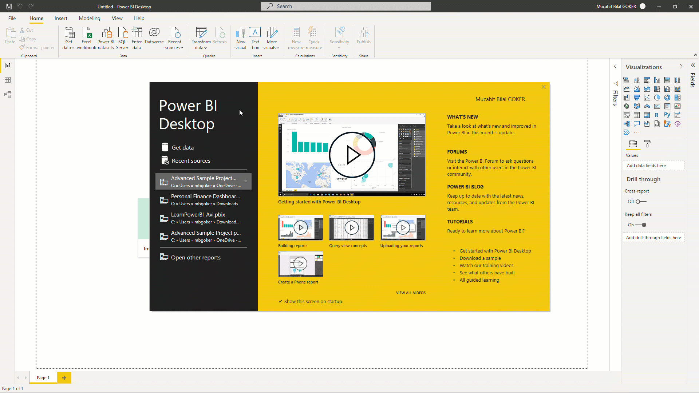
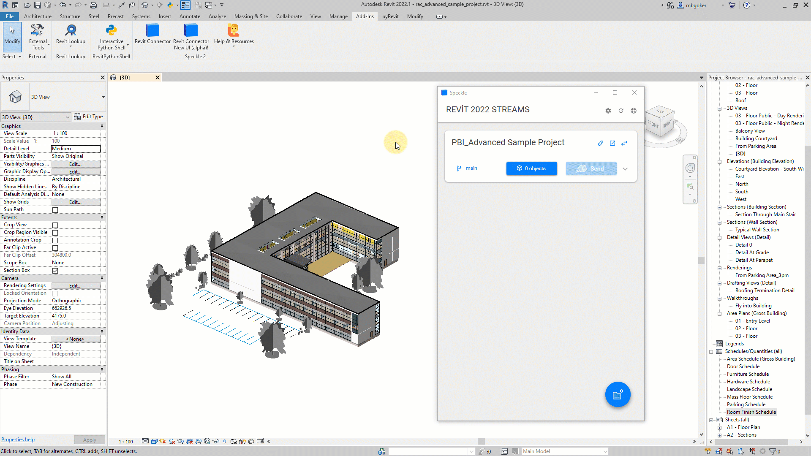
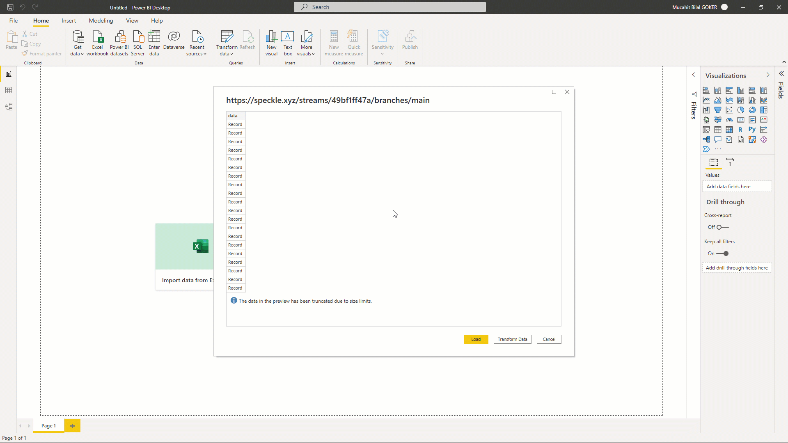
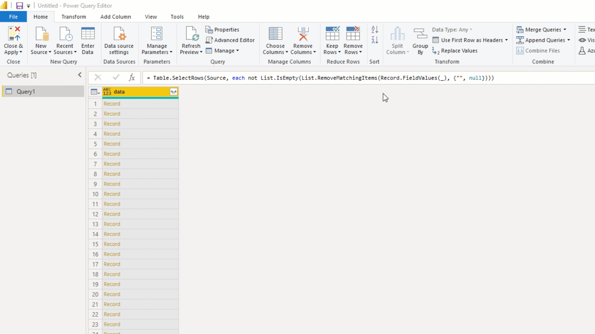
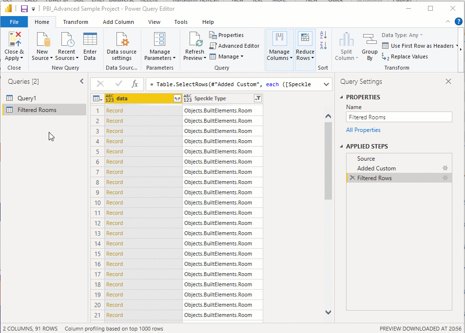
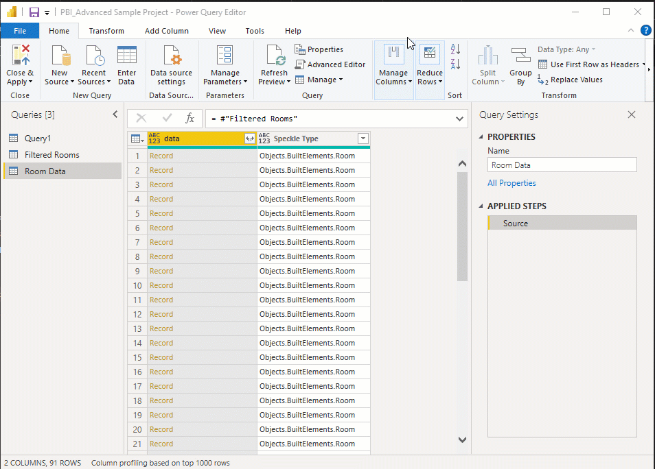
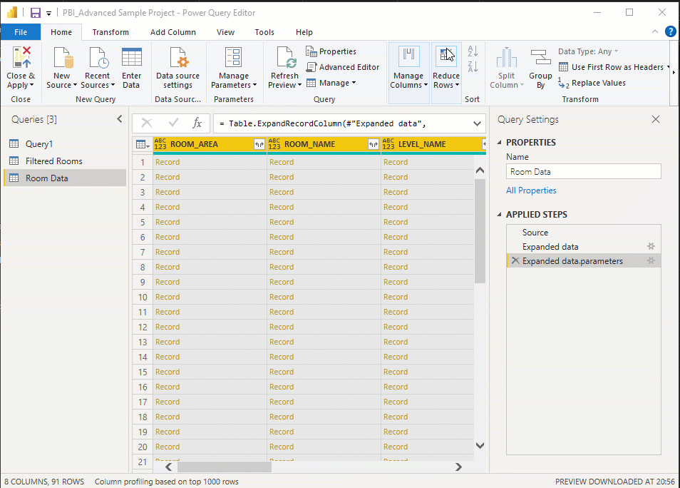
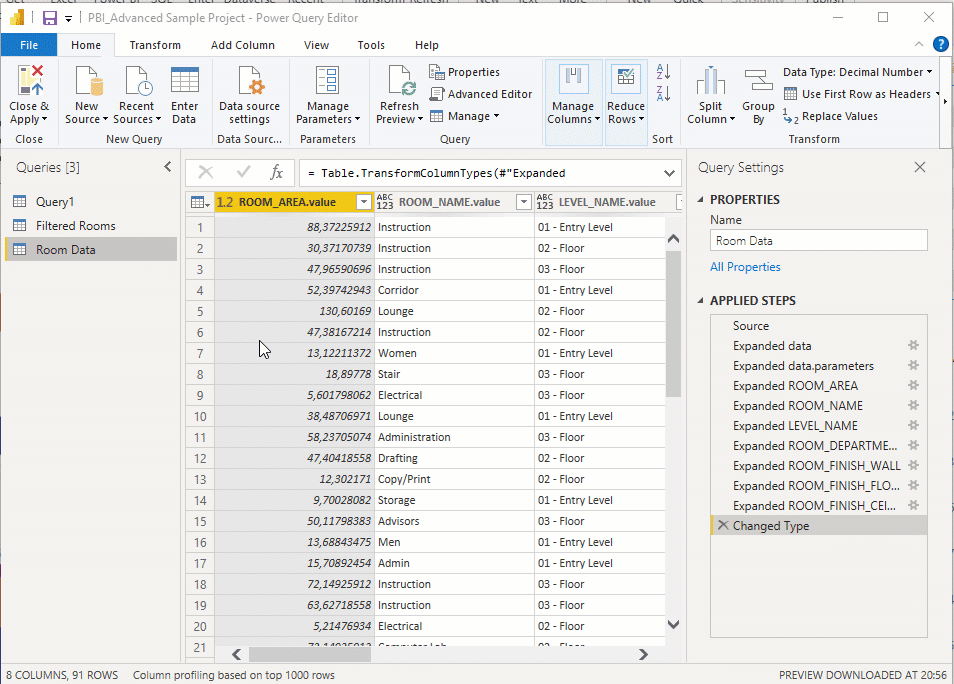
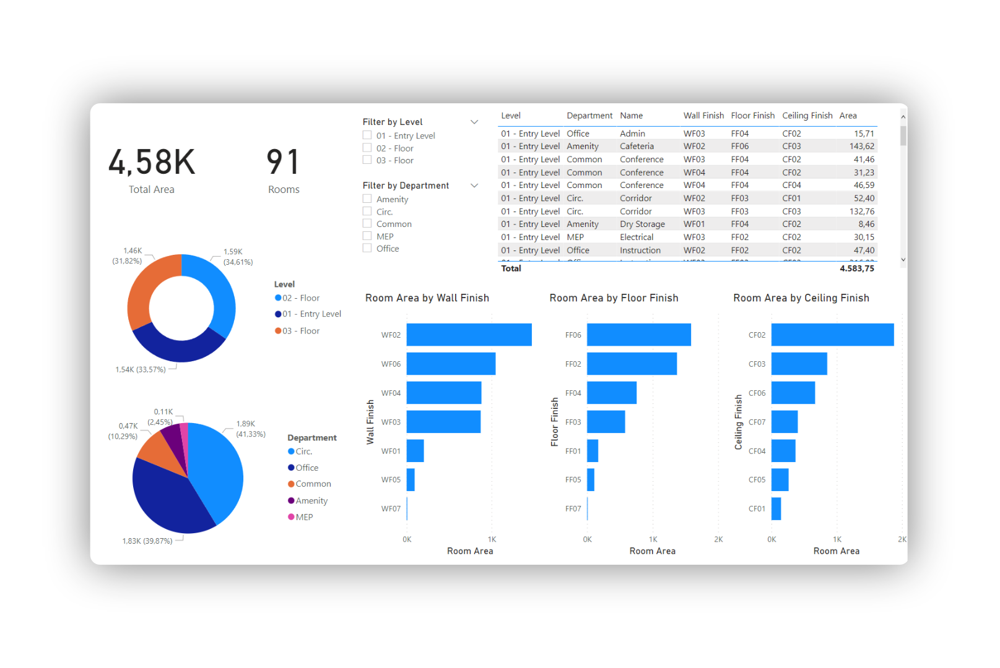

Understanding and visualizing building data is essential to any data-driven workflow and being Speckle a data platform, it follows quite naturally that you might want to analyze streams and commits coming from it. And thats what we are going to do in this tutorial. I am going to show you how you can visualize Revit Room data in Power BI using Speckle connectors.

Let's get started!🏃‍♂️

### **Prefer watching than reading? Here's a video too!**



## Tutorial Files

You can access the Revit project document used in the tutorial 👇:

<a href="rac_advanced_sample_project.rvt" download>
    
</a>

The stream used in this tutorial is right here👇!

<iframe src="https://speckle.xyz/embed?stream=3316738cd8&object=f27e10be39c9e870f5bf55860ddbeb11" width=100% height=400></iframe>

## Prerequisites

To follow this tutorial you'll need the following:

- Revit 2018 - 2022 (I'll be using 2022)
- Microsoft Power BI (I’ll be using the free version)
- a Speckle account (you can get one **for free🎉** at **[https://speckle.xyz/](https://speckle.xyz/)**)
- the Speckle Connector for Revit (install it via **[Manager](https://speckle.guide/user/manager.html)**)
- the Speckle Connector for Power BI (install in from its [repo](https://github.com/specklesystems/speckle-powerbi))

Since we are working with Revit and Power BI, basic knowledge of both tools will be essential.



## Installing Connectors

Installing connectors is the first step of data communication. They take care of sending and receiving data in the host software to and from Speckle server. 

### Installing Revit Connector

Installing the **Revit** connector is as simple as finding it in the list of available connectors in **Speckle Manager** and clicking “**Install**”.

### Installing Power BI Connector

Installing Power BI Connector is not as straightforward as other connector since it’s in Alpha. To install Power BI Speckle Connector:

1. Go to **Speckle Power BI Repo**
2. Go to the releases page and download the .mez file of the latest release.
3. Copy the downloaded file into the following folder:
`YOUR_USER_FOLDER\Documents\Power BI Desktop\Custom Connectors\`
If the folder does not exist, create one and name it `Custom Connectors`.
    
    
    
4. After you copy the file, open Power BI.
5. Go to `Settings -> Security -> Data Extensions` and activate the `(Not Recommended) Allow any extension to load without validation or warning` option.
    
    
    
6. Now, restart Power BI and you should see `Speckle (beta)` appear in the data source.
    
    
    

## Creating a Stream and Sending Data from Revit

Let's open the document and create a new stream. It just takes three steps:

1. Go to **Add-Ins** and open **Revit connector**.
2. Click the blue button on the **bottom right corner**.
3. Use text box to **name** your stream and click the "**+**" button to create a new stream.

There are couple ways to send data from Revit. We are going to send by category and select the Rooms.

1. Click on the **blue button** in the middle of the card.
2. Select the “**Set/Edit Objects Filter**”.
3. Type in the category name and select it.
4. Click on “**Set Filter**” option
5. And finally **double click** on **Send** to send data straight away.

Voila! You have send your Revit rooms. When sending data from Revit, Speckle takes care of converting the data to a Speckle friendly format. Let’s view it in Speckleverse!

## Receiving in Power BI

Let’s receive room data in Power BI. 

1. Click on Get Data and search for Speckle. 
2. Search for Speckle and select `Speckle - Get stream by URL(Beta)` 
3. Click `Connect`.
4. Copy the `Stream URL` , paste it in the new screen and click **OK**.

Congrats, now you should see a screen that shows **Speckle Objects** as **Records**.



## Transforming Data in Power BI

In order to create dashboards using the data received, it needs to be transformed into more readable format. Let’s do that!

1. Click on Transform data to access Power Query Editor
2. Received data includes blank rows at the moment. So we have to remove that first. From `Remove Rows`, select `Remove Blank Rows`.
    
    
    
3. We are not going to edit this table directly. So we are going to create a reference to that. `Right click` on table, select `Reference`. Lets rename this table as “Filtered Rooms” because we are going to filter only rooms from the received data.
    
    
    
4. Received data includes mesh geometry as well. So we have to filter the room objects. Lets add a custom column and get Speckle Types of objects using Record functions. Then filter only room objects.
    
    
    
5. Lets create a reference to **Filtered Rooms** table this time and rename it as **Room Data.**
    
    
    
6. To access parameters attribute of the records, simply click on the **expand** icon and select the attribute you want to expand. After you have the **parameters record**, expand it one more time to access the **specific parameter records** you want to access.
    
    
    
7. Now lets access the values of those parameters. Follow the steps mentioned above but select **value** attribute to get their values. Do this for all parameter columns.
    
    
    
8. Finally rename all columns into their parameter names such as “**Room Area**”, “**Room Name**” etc.
    
    
    
9. Now we are done tranforming lets close the Query Editor and apply any pending changes.

Congrats👏, you have imported your very first Speckle data into **Power BI**. You should be proud of yourself. Now you can create beautiful dashboards such as the one below👇. 

Watch the video above if you don’t know how to create **Cards, Donut Charts and Slicers.** If you are more of a reader, then read the **Visualization documentation [here](https://docs.microsoft.com/en-us/power-bi/visuals/power-bi-report-visualizations)**👈

---

## **Conclusion**

We hope you enjoyed this tutorial and found it useful!

**Speckle is an Open Source project** and we really ❤️ feedback, so if you have any questions, comments, critiques, or praises please let us know on our **[community forum](https://speckle.community/)**.